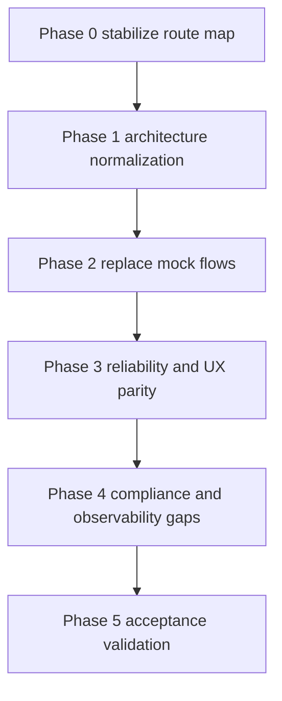

# Implementation Recovery Plan

## 1) Source of truth and objective

- Audit baseline used: `implimentation_plan.md`
- Recovery objective: eliminate plan mismatches, remove mock and placeholder flows, restore route reliability, and enforce modular structure using:
  - `apps/web/src/app` for route entry files only
  - `apps/web/src/api` for API domain logic and integrations
  - `apps/web/src/modules` for feature vertical slices
  - `apps/web/src/components` for shared reusable UI

## 2) Current status snapshot

### Completed in this audit cycle

- Read and mapped `implimentation_plan.md` requirements.
- Per-section code audit completed for dashboard, auth, legal, content, planner, jobs, billing, AI, WP integration, and middleware.
- Verified recent sidebar and theme modernization work and marked as preserve and do not regress.

### Active blocker

- Non-markdown refactors and route runtime verification require implementation in code mode.

### Next execution trigger

- Switch to code mode and execute Phase 1 in this document in dependency order.

---

## 3) Preserve and protect existing progress

The following files contain valuable recent progress and must be preserved while refactoring:

- `apps/web/src/components/app-sidebar.tsx`
- `apps/web/src/components/nav-main.tsx`
- `apps/web/src/components/layout/ThemeToggle.tsx`
- `apps/web/src/components/layout/AppShell.tsx`
- `apps/web/src/components/providers/theme-provider.tsx`
- `apps/web/src/components/nav-user.tsx`

### Protection rules

1. Keep current responsive sidebar behavior and collapsible navigation model.
2. Keep theme switching behavior and persistence via `next-themes`.
3. Keep navigation hierarchy UX improvements unless route correctness requires label or href changes.
4. Refactors around these files should be additive and compatibility-safe.

---

## 4) Architecture compliance findings

## Critical mismatches

1. Missing `apps/web/src/api` layer
   - API and business orchestration are mixed into route-adjacent actions and module actions.
   - Target: introduce `src/api` domain services and keep route handlers thin.

2. Route scoped actions under `app`
   - `apps/web/src/app/dashboard/settings/actions/*` violates route only intent for `src/app`.
   - Target: move to `apps/web/src/modules/settings/actions/*` and import from route entries.

3. Route namespace drift
   - Multiple actions revalidate `/projects/*`, while active UI uses `/dashboard/*`.
   - Middleware also redirects authenticated users to `/projects` even though route is absent.

4. Missing plan required dashboard project route family
   - No `apps/web/src/app/dashboard/projects/*` route entries despite plan expectation.

---

## 5) Section by section mismatch audit

## A. Foundation and app shell

- Finding: UI foundation partially aligned, but one key shadcn config mismatch.
- Mismatch:
  Ignore::: Its already correct - `apps/web/components.json` uses `baseColor: neutral` while plan specifies blue base. - Style is blue this is fine , Ignore it
// Impact: inconsistent design tokens and generated component defaults.
// Target end state: shadcn config and global tokens aligned to blue primary system.

## B. Route reliability and navigation

- Findings:
  - Home links to `/demo` but no matching route exists.
  - Middleware redirects authenticated users to `/projects` route that does not exist.
  - App uses `/dashboard/*` but multiple invalidation paths and legacy logic still target `/projects/*`.
- Affected routes:
  - Broken: `/demo`, `/projects`
  - Active: `/dashboard/content`, `/dashboard/planner`, `/dashboard/ai`, `/dashboard/jobs`, `/dashboard/billing`, `/dashboard/settings`

## C. Authentication and verification

- Findings:
  - Email verification sender remains TODO and only logs to console.
  - `VerifyEmailBanner` resend is explicit placeholder timeout.
  - Forgot password link is dead href.
- Affected files:
  - `apps/web/src/lib/auth.ts`
  - `apps/web/src/modules/auth/components/VerifyEmailBanner.tsx`
  - `apps/web/src/modules/auth/components/LoginForm.tsx`

## D. Multi tenant and org flows

- Findings:
  - `OrgSwitcher` is mock local state and not tied to tenant context.
  - Projects actions exist, but no reliable dashboard projects page and route family.
- Affected files:
  - `apps/web/src/modules/org/components/OrgSwitcher.tsx`
  - `apps/web/src/modules/projects/actions/create-project.ts`
  - `apps/web/src/modules/projects/actions/delete-project.ts`

## E. Billing and plans

- Findings:
  - Billing page uses hardcoded plan usage values.
  - Pricing and billing history are static and disconnected from Stripe flow.
- Affected files:
  - `apps/web/src/app/dashboard/billing/page.tsx`
  - `apps/web/src/modules/billing/components/CurrentPlan.tsx`
  - `apps/web/src/modules/billing/components/PricingTable.tsx`

## F. Content and editor flows

- Findings:
  - `dashboard/content` page is mock cards and fake recent posts list.
  - Content editor module has meaningful action wiring, but dashboard route does not route users into a reliable real data flow.
- Affected files:
  - `apps/web/src/app/dashboard/content/page.tsx`
  - `apps/web/src/modules/content/components/ContentEditor.tsx`

## G. AI provider management

- Findings:
  - Provider list uses local mock state, no persisted provider CRUD path from UI.
  - Fallback chain management UI from plan is missing.
- Affected files:
  - `apps/web/src/modules/ai/components/ProviderList.tsx`
  - `apps/web/src/modules/ai/actions/generate-content.ts`

## H. Planner and jobs

- Findings:
  - `CalendarView` is local mock state and not bound to scheduled post records.
  - `JobLogsList` is local mock state and not connected to job runs.
- Affected files:
  - `apps/web/src/modules/planner/components/CalendarView.tsx`
  - `apps/web/src/modules/jobs/components/JobLogsList.tsx`

## I. WordPress connection

- Findings:
  - Connection save is present, but `testConnection` marks status ok without real WP client ping.
  - Route invalidation still points to non-existent `/projects/*` paths.
- Affected files:
  - `apps/web/src/modules/wp/actions/test-connection.ts`
  - `apps/web/src/modules/wp/actions/connect-plugin.ts`
  - `apps/web/src/modules/wp/actions/connect-fallback.ts`
  - `apps/web/src/modules/wp/actions/disconnect.ts`

## J. Legal, compliance, and docs

- Findings:
  - Privacy, terms, cookies pages exist.
  - DPA page expected by plan is missing.
  - Public API docs routes and health endpoints expected by plan are missing.
- Affected routes and files:
  - Missing: `/legal/dpa`
  - Missing: `/api/health`
  - Missing: `/docs/api` and docs API spec route

---

## 6) Route and reliability matrix

| Route | Current status | Gap type | Target state |
|---|---|---|---|
| `/` | Available | Links to missing demo | Either add `/demo/components` flow or remove invalid link |
| `/login` | Available | Forgot password dead link | Provide real recovery route or remove dead path |
| `/signup` | Available | Verification depends on console mail | Real transactional email flow |
| `/verify-email` | Available | Partial placeholder messaging and resend flow | Real resend with rate limit and clear UX |
| `/dashboard` | Redirects to content | Acceptable | Keep redirect |
| `/dashboard/content` | Mostly mock | Data flow gap | Real project scoped content dashboard |
| `/dashboard/planner` | Mock | Data flow gap | Persisted schedule CRUD and calendar |
| `/dashboard/ai` | Mock | Data flow gap | Provider CRUD plus test plus fallback chain |
| `/dashboard/jobs` | Mock | Data flow gap | Query real job runs with filters |
| `/dashboard/billing` | Hardcoded | Data flow gap | Real usage and plan actions |
| `/dashboard/settings` | Partial | Action wiring gap | Wire export and delete actions with confirmations |
| `/dashboard/projects` | Missing | Route missing | Add full route and module integration |
| `/demo` | Missing | Broken route | Add or remove link |
| `/projects` | Missing | Legacy route drift | Remove dependency or redirect to dashboard projects |

---

## 7) Dependency ordered remediation roadmap

## Phase 0: Stabilize route map and path contracts

### Scope

- Eliminate hard broken paths and route drift before deeper refactor.

### Actions

1. Introduce centralized route constants for dashboard and project paths.
2. Fix middleware redirect target from `/projects` to canonical dashboard route.
3. Fix all `revalidatePath` calls still targeting `/projects/*`.
4. Resolve `/demo` mismatch by either:
   - adding route, or
   - removing link until ready.

### Affected files

- `apps/web/src/middleware.ts`
- `apps/web/src/modules/projects/actions/create-project.ts`
- `apps/web/src/modules/projects/actions/delete-project.ts`
- `apps/web/src/modules/content/actions/save-draft.ts`
- `apps/web/src/modules/wp/actions/connect-plugin.ts`
- `apps/web/src/modules/wp/actions/connect-fallback.ts`
- `apps/web/src/modules/wp/actions/test-connection.ts`
- `apps/web/src/modules/wp/actions/disconnect.ts`
- `apps/web/src/app/page.tsx`

### Exit criteria

- No references to missing `/projects` route in redirects and invalidation.
- No user facing link to non-existent route.

## Phase 1: Architecture normalization

### Scope

- Enforce app routes only in `src/app`, domain logic in `src/api`, feature implementation in `src/modules`.

### Actions

1. Create `apps/web/src/api` with domain folders:
   - `auth`, `org`, `projects`, `billing`, `content`, `planner`, `jobs`, `wp`, `ai`.
2. Move route local settings actions out of `src/app/dashboard/settings/actions` to `src/modules/settings/actions`.
3. Refactor route entries to thin wrappers that compose module components and call module or api actions.
4. Add missing dashboard projects route entry and module page components.

### Affected files and folders

- Create: `apps/web/src/api/**`
- Move from: `apps/web/src/app/dashboard/settings/actions/**`
- Create: `apps/web/src/app/dashboard/projects/page.tsx`
- Create and update: `apps/web/src/modules/projects/components/**`

### Exit criteria

- `src/app` contains route entry and page composition only.
- Settings actions no longer live under route folder.
- Dashboard projects route exists and renders.

## Phase 2: Replace mock and placeholder feature flows

### Scope

- Replace all user visible mock datasets with real data access and action flows.

### Actions by feature

1. Org:
   - Replace `OrgSwitcher` mock state with tenant data from DB plus active org state.
2. Billing:
   - Replace hardcoded values on billing page with org plan and usage query.
   - Wire checkout and portal actions.
3. AI:
   - Replace mock provider list with persisted provider CRUD and test actions.
   - Add fallback chain editor.
4. Planner:
   - Bind calendar and scheduling UI to `ScheduledPost` records and schedule actions.
5. Jobs:
   - Bind job log table to `JobRun` query and details.
6. Content dashboard:
   - Replace fake cards and fake recent posts with real project content state and editor entry points.
7. Auth verification:
   - Remove resend placeholder and integrate proper verification resend with rate limiting.
8. WP connection test:
   - Replace synthetic status update with actual ping through WP client.

### Affected files

- `apps/web/src/modules/org/components/OrgSwitcher.tsx`
- `apps/web/src/app/dashboard/billing/page.tsx`
- `apps/web/src/modules/billing/components/*`
- `apps/web/src/modules/ai/components/ProviderList.tsx`
- `apps/web/src/modules/planner/components/CalendarView.tsx`
- `apps/web/src/modules/jobs/components/JobLogsList.tsx`
- `apps/web/src/app/dashboard/content/page.tsx`
- `apps/web/src/modules/auth/components/VerifyEmailBanner.tsx`
- `apps/web/src/modules/wp/actions/test-connection.ts`

### Exit criteria

- No remaining local mock arrays for org, planner, jobs, provider list.
- All dashboard pages render persisted data.

## Phase 3: UI and UX consistency to plan

### Scope

- Align with shadcn first approach and plan level consistency.

### Actions

1. Set shadcn base color configuration to blue.
2. Replace non-shadcn native controls in onboarding and planner with shadcn components where available.
3. Ensure page headers, spacing, and card patterns are consistent across dashboard routes.
4. Keep existing sidebar, navigation, and theme improvements intact.

### Affected files

- `apps/web/components.json`
- `apps/web/src/modules/onboarding/components/OnboardingWizard.tsx`
- `apps/web/src/modules/planner/components/CalendarView.tsx`
- Dashboard route pages for consistency pass

### Exit criteria

- No unjustified native controls in core product surfaces.
- Sidebar and theme modernization remains functional.

## Phase 4: Remaining plan parity gaps

### Scope

- Address key missing plan sections that materially affect readiness.

### Actions

1. Add legal DPA route.
2. Add health endpoint.
3. Add API docs shell route and openapi endpoint scaffold.
4. Replace auth email sender TODO with actual provider implementation.

### Exit criteria

- Legal and operational baseline routes exist and are accessible.

## Phase 5: Validation and acceptance hardening

### Scope

- Confirm route accessibility, behavior correctness, and non-regression.

### Actions

1. Build route accessibility suite covering all public and dashboard paths.
2. Add feature smoke checks for content, planner, jobs, billing, AI, WP connection.
3. Add regression checks for preserved sidebar and theme files.
4. Verify no remaining references to deprecated route namespace.

### Exit criteria

- Route matrix green.
- Mock and placeholder audit returns no critical gaps.

---

## 8) Validation strategy

## Static validation

- Typecheck and lint across web and worker packages.
- Search based checks:
  - placeholder markers
  - local mock arrays in production modules
  - stale `/projects` path references

## Runtime route validation

- Smoke navigation test for:
  - `/`, `/login`, `/signup`, `/verify-email`
  - `/dashboard/*` feature routes
  - legal routes including DPA
  - health and docs routes when added

## Feature validation

- Org switcher returns tenant-backed entries.
- Planner create and update persists and re-renders.
- Jobs list shows persisted job runs.
- Billing shows real usage and plan state.
- AI provider list reflects database state.
- WP connection test performs real network verification.

---

## 9) Acceptance criteria

1. Architecture criteria
   - Route files are in `src/app` and do not host business logic.
   - API orchestration layer exists under `src/api`.
   - Feature slices live under `src/modules` and are referenced by routes.

2. Reliability criteria
   - No dead links in primary navigation and landing pages.
   - No auth redirect targets to non-existent routes.
   - No stale cache invalidation paths.

3. Functional criteria
   - Dashboard feature pages use persisted data flows, not static local mock arrays.
   - Auth verification and resend are real.
   - Billing and usage are tenant aware.

4. UX criteria
   - Sidebar and theme modernization behavior unchanged or improved.
   - shadcn driven UI consistency across pages.

5. Plan parity criteria
   - Core plan sections are represented in working route and module flows.
   - Remaining non-core items are tracked as explicit follow-ups with no hidden gaps.

---

## 10) Orchestrated subtask packets

## Packet A: Route contract and middleware stabilization

- Owner focus: routing, cache invalidation, middleware safety
- Inputs: route map, stale path references
- Outputs: stable route constants and corrected redirects

## Packet B: Architecture refactor

- Owner focus: `src/api` introduction and action relocation
- Inputs: current action and route layout
- Outputs: clean dependency boundaries and thin routes

## Packet C: Feature data flow conversion

- Owner focus: org, billing, AI, planner, jobs, content dashboard
- Inputs: module UI plus existing prisma models and actions
- Outputs: persisted and tenant scoped UI behavior

## Packet D: UX consistency and compliance gaps

- Owner focus: shadcn consistency, legal DPA, health, docs scaffold
- Outputs: visual and operational parity improvements

## Packet E: Validation and signoff

- Owner focus: route matrix, feature smoke, regression checks
- Outputs: pass fail checklist and release readiness decision

---

## 11) Live update log

### Baseline update

- Status: audit completed and roadmap created
- Completed: findings, affected files, target state, phased plan, validation, acceptance criteria
- Blockers: code mode required for implementation and runtime verification
- Next: execute Phase 0 then Phase 1 immediately after mode switch

### 2026-02-18 Phase update: Projects WP connection UX + sidebar readability

- Status: completed with validation and follow-up fixes

#### Completed work

1. Project-card WordPress connection dialog integrated on `/dashboard/projects`
   - Added dedicated **Connect WordPress** action per project card.
   - Embedded connection management into a full dialog for project-scoped setup.
   - Updated route-to-module data contract to pass full connection payload.
   - Files:
     - `apps/web/src/app/dashboard/projects/page.tsx`
     - `apps/web/src/modules/projects/components/ProjectsPage.tsx`

2. WordPress connection manager upgraded from split cards to guided tabbed flow
   - Added tabs for:
     - Plugin Pairing (HMAC)
     - Username + Application Password
   - Added step-by-step setup instructions via accordion in both tabs.
   - Added stronger field validation and disabled-submit states.
   - Added refresh after save/test/disconnect to keep project status card in sync.
   - File:
     - `apps/web/src/modules/wp/components/WpConnectionManager.tsx`

3. Sidebar readability improvements (while preserving collapsible model)
   - Increased desktop sidebar width token from `16rem` to `18rem`.
   - Improved nav label typography and spacing hierarchy.
   - Improved sidebar header and quick-action spacing for denser but clearer layout.
   - Files:
     - `apps/web/src/components/ui/sidebar.tsx`
     - `apps/web/src/components/nav-main.tsx`
     - `apps/web/src/components/app-sidebar.tsx`

4. Active-project and content-flow consistency fixes completed in this pass
   - Added active project context and project switcher flow for dashboard route family.
   - Scoped content, planner, and jobs pages to active project by default.
   - Added draft edit flow into content editor via `postId` hydration.
   - Fixed per-project content card action to target each card project id (not global active id).
   - Files:
     - `apps/web/src/api/projects/service.ts`
     - `apps/web/src/modules/projects/actions/set-active-project.ts`
     - `apps/web/src/modules/projects/components/ProjectSwitcherClient.tsx`
     - `apps/web/src/components/layout/AppShell.tsx`
     - `apps/web/src/app/dashboard/layout.tsx`
     - `apps/web/src/app/dashboard/content/page.tsx`
     - `apps/web/src/app/dashboard/content/new/page.tsx`
     - `apps/web/src/app/dashboard/planner/page.tsx`
     - `apps/web/src/app/dashboard/jobs/page.tsx`
     - `apps/web/src/modules/content/components/ContentEditor.tsx`

5. AI generation and resilience hardening completed in this pass
   - Added AI source mode + provider/model controls in editor.
   - Added provider/mode compatibility enforcement in server action.
   - Added BYOK plan/role enforcement in AI service.
   - Hardened optional env parsing to prevent startup crashes from empty optional vars.
   - Added dashboard-level error boundary and auth semantics fixes.
   - Files:
     - `apps/web/src/modules/ai/actions/generate-content.ts`
     - `apps/web/src/api/ai/service.ts`
     - `apps/web/src/lib/env.ts`
     - `apps/web/src/app/dashboard/error.tsx`
     - `apps/web/src/modules/auth/components/LoginForm.tsx`
     - `apps/web/src/modules/auth/components/SignupForm.tsx`

6. Linting baseline normalized for non-interactive checks
   - Added ESLint config for Next.js web app.
   - Added `eslint-config-next` dev dependency for deterministic lint runs.
   - Addressed lint violations (`react/no-unescaped-entities`, `@next/next/no-img-element`).
   - Files:
     - `apps/web/.eslintrc.json`
     - `apps/web/package.json`
     - `apps/web/src/modules/auth/components/LoginForm.tsx`
     - `apps/web/src/modules/onboarding/components/OnboardingWizard.tsx`
     - `apps/web/src/modules/content/components/FeaturedImagePicker.tsx`

#### Validation executed

- TypeScript validation:
  - Command: `cd apps/web && npm run typecheck`
  - Result: pass.
- Lint validation:
  - Command: `cd apps/web && npm run lint`
  - Result: pass (no warnings/errors after fixes).
- Combined gate:
  - Command: `cd apps/web && npm run lint && npm run typecheck`
  - Result: pass.
- Runtime evidence from active dev server:
  - Dashboard route families compile and resolve with authenticated data queries observed for:
    - `/dashboard/projects`
    - `/dashboard/content`
    - `/dashboard/content/new`
    - `/dashboard/planner`
    - `/dashboard/jobs`
    - `/dashboard/ai`
    - `/dashboard/billing`
    - `/dashboard/settings`

#### Open blockers

1. Better Auth warning remains until GitHub OAuth env vars are set (`GITHUB_CLIENT_ID`, `GITHUB_CLIENT_SECRET`).
2. Full end-to-end browser assertions for every dashboard action path remain a final hardening step.

#### Next steps

1. Complete final browser smoke checklist with authenticated interactions across all dashboard routes and record screenshots.
2. Continue remaining architecture normalization and mock-replacement backlog from Phase 1/2 for non-completed sections (notably billing deep Stripe flow and remaining onboarding/planner UX parity).
3. Close remaining route parity gaps and update this document at each phase checkpoint with blockers and acceptance status.
